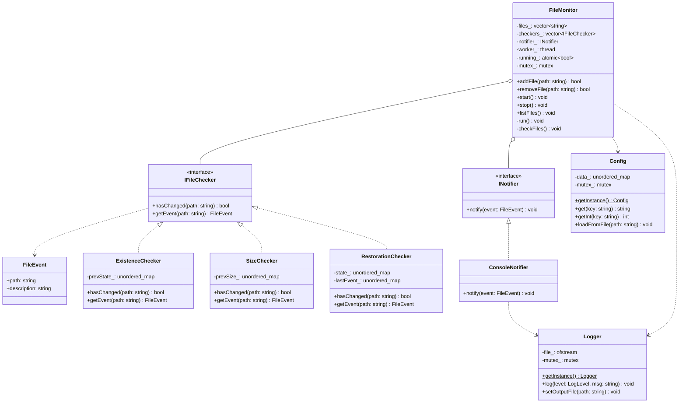
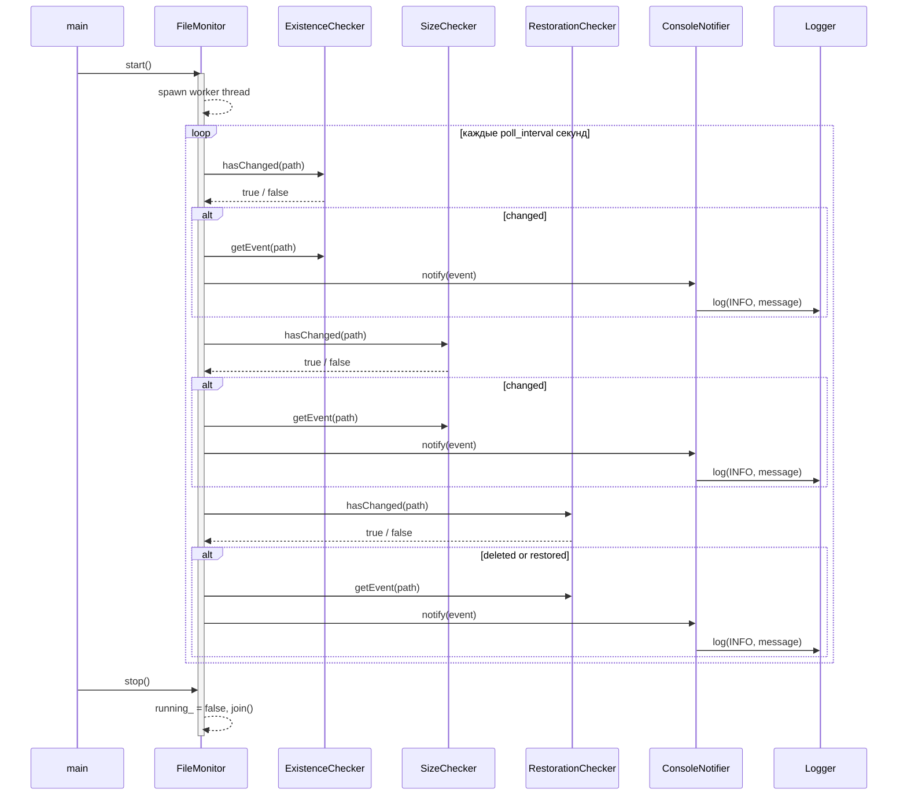

# File Monitor

Консольная утилита для мониторинга изменений файлов (существование, размер, восстановление после удаления).

## Архитектура

Проект следует принципам **SOLID** и использует паттерн **Singleton**:

| Принцип       | Реализация                                                                                                                    |
| ------------- | ----------------------------------------------------------------------------------------------------------------------------- |
| **SRP**       | `FileMonitor` — оркестрация; `Logger` — журналирование; `Config` — конфигурация; каждый чекер отвечает за одно свойство файла |
| **OCP**       | Новый тип проверки добавляется без изменения `FileMonitor` — достаточно реализовать `IFileChecker`                            |
| **LSP**       | Все чекеры взаимозаменяемы везде, где ожидается `IFileChecker*`                                                               |
| **ISP**       | `IFileChecker` (2 метода) и `INotifier` (1 метод) — минимальные целевые интерфейсы                                            |
| **DIP**       | `FileMonitor` зависит только от абстракций; конкретные типы создаются в `main.cpp`                                            |
| **Singleton** | `Logger` и `Config` — потокобезопасные синглтоны (Meyers singleton, C++11)                                                    |

### Диаграмма классов



### Диаграмма сигналов

```mermaid
flowchart TD
    FS[(File System)]

    subgraph Checkers["Источники сигналов (Checkers)"]
        EC["ExistenceChecker\nhasChanged()"]
        SC["SizeChecker\nhasChanged()"]
        RC["RestorationChecker\nhasChanged()"]
    end

    subgraph Monitor["Маршрутизатор (FileMonitor)"]
        CF["checkFiles()\n[poll loop]"]
    end

    subgraph Notifiers["Получатели сигналов (Notifiers)"]
        CN["ConsoleNotifier\nnotify(FileEvent)"]
    end

    subgraph Singletons[""]
        L["Logger::getInstance()\nlog(level, msg)"]
        C["Config::getInstance()\ngetInt(poll_interval)"]
    end

    OUT[/"stdout\n[EVENT] path: description"/]

    FS -->|"stat(path)"| EC
    FS -->|"file_size(path)"| SC
    FS -->|"stat(path)"| RC

    EC -->|"signal: created / deleted\ngetEvent() → FileEvent"| CF
    SC -->|"signal: size changed\ngetEvent() → FileEvent"| CF
    RC -->|"signal: deleted / restored\ngetEvent() → FileEvent"| CF

    CF -->|"emit: notify(FileEvent)"| CN
    CN -->|"slot: log(INFO, ...)"| L
    L --> OUT

    C -.->|"poll_interval"| CF

    style EC fill:#4a90d9,color:#fff
    style SC fill:#4a90d9,color:#fff
    style RC fill:#4a90d9,color:#fff
    style CN fill:#7ab648,color:#fff
    style L fill:#e8a838,color:#fff
    style C fill:#e8a838,color:#fff
    style CF fill:#9b59b6,color:#fff
```

### Диаграмма последовательности (цикл мониторинга)



### Структура проекта

```
include/
  IFileChecker.h              — интерфейс проверки изменений
  INotifier.h                 — интерфейс уведомлений
  FileMonitor.h               — оркестратор мониторинга
  ConsoleNotifier.h           — вывод событий в stdout
  Logger.h                    — логгер (Meyers singleton, thread-safe)
  Config.h                    — конфигурация (Meyers singleton)
  checkers/
    ExistenceChecker.h        — проверка создания / удаления
    SizeChecker.h             — проверка изменения размера
    RestorationChecker.h      — отслеживание удаления и восстановления
src/                          — реализации
tests/                        — GoogleTest unit-тесты
```

## Сборка

```bash
cmake -B build
cmake --build build
```

## Тесты

```bash
cd build && ctest --output-on-failure
```

## Использование

```bash
./build/file_monitor [config.ini]
```

| Команда         | Описание                            |
| --------------- | ----------------------------------- |
| `add <path>`    | Добавить файл в мониторинг          |
| `remove <path>` | Удалить файл из мониторинга         |
| `start`         | Начать мониторинг (отдельный поток) |
| `stop`          | Остановить мониторинг               |
| `list`          | Список наблюдаемых файлов           |
| `quit`          | Выход                               |

### Пример config.ini

```ini
poll_interval=2
log_level=INFO
```
