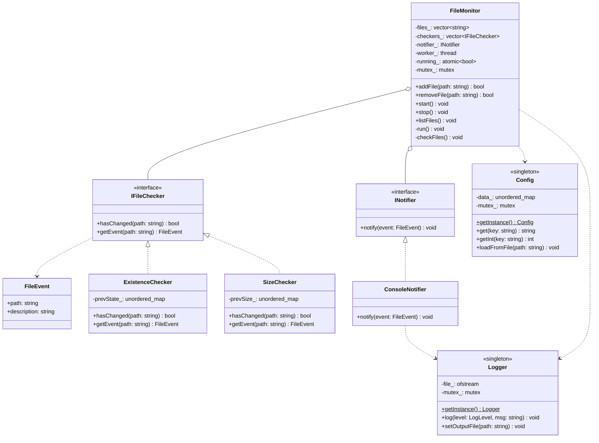
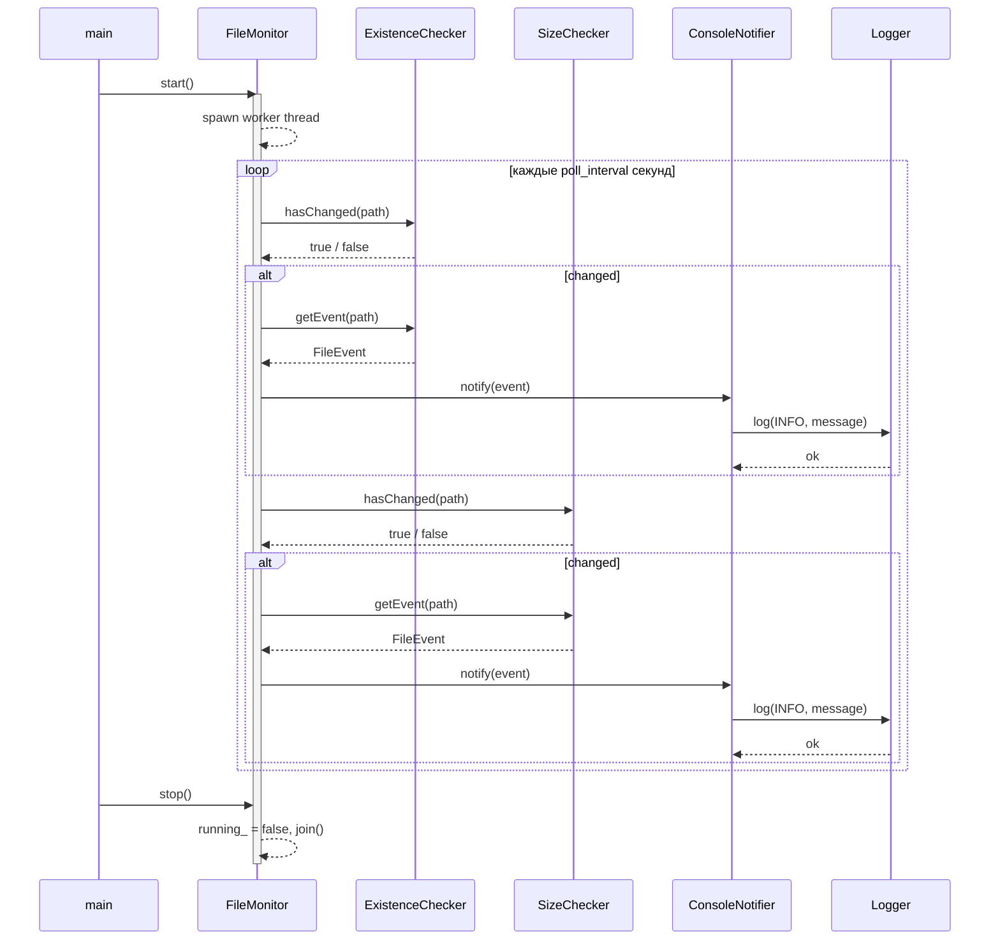

# File Monitor

Консольная утилита для мониторинга изменений файлов (существование, размер).

## Архитектура

Проект следует принципам **SOLID** и использует паттерн **Singleton**:

| Принцип       | Реализация                                                                                                                              |
| ------------- | --------------------------------------------------------------------------------------------------------------------------------------- |
| **SRP**       | `FileMonitor` — оркестрация; `Logger` — журналирование; `Config` — конфигурация; `ExistenceChecker`/`SizeChecker` — конкретные проверки |
| **OCP**       | Новый тип проверки добавляется без изменения `FileMonitor` — достаточно реализовать `IFileChecker`                                      |
| **LSP**       | `ExistenceChecker` и `SizeChecker` взаимозаменяемы везде, где ожидается `IFileChecker*`                                                 |
| **ISP**       | `IFileChecker` (2 метода) и `INotifier` (1 метод) — минимальные целевые интерфейсы                                                      |
| **DIP**       | `FileMonitor` зависит только от абстракций; конкретные типы создаются в `main.cpp`                                                      |
| **Singleton** | `Logger` и `Config` — потокобезопасные синглтоны (Meyers singleton, C++11)                                                              |

### Диаграмма классов



### Диаграмма последовательности (цикл мониторинга)



### Структура проекта

```
include/
  IFileChecker.h          — интерфейс проверки изменений
  INotifier.h             — интерфейс уведомлений
  FileMonitor.h           — оркестратор мониторинга
  ConsoleNotifier.h       — вывод событий в stdout
  Logger.h                — Singleton логгер (thread-safe)
  Config.h                — Singleton конфигурация
  checkers/
    ExistenceChecker.h    — проверка существования файла
    SizeChecker.h         — проверка изменения размера
src/                      — реализации
tests/                    — GoogleTest unit-тесты
```

## Сборка

```bash
cmake -B build
cmake --build build
```

## Тесты

```bash
cd build && ctest --output-on-failure
```

## Использование

```bash
./build/file_monitor [config.ini]
```

| Команда         | Описание                            |
| --------------- | ----------------------------------- |
| `add <path>`    | Добавить файл в мониторинг          |
| `remove <path>` | Удалить файл из мониторинга         |
| `start`         | Начать мониторинг (отдельный поток) |
| `stop`          | Остановить мониторинг               |
| `list`          | Список наблюдаемых файлов           |
| `quit`          | Выход                               |

### Пример config.ini

```ini
poll_interval=2
log_level=INFO
```
